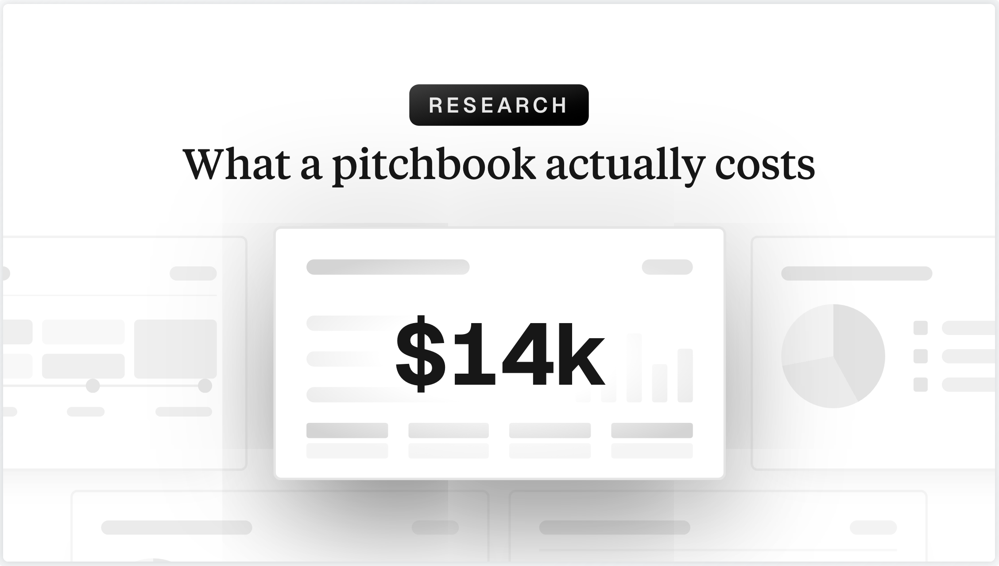

<picture>
  
</picture>

# What does a pitchbook actually cost? We built a transparent model

A source-graded Monte Carlo model of deck production in IB, PE and consulting: $6.6k to $26k per sell-side pitchbook, and roughly half of the cost is revision churn.

This repository is the method, data and code behind the article [What does a pitchbook actually cost?](https://gedonus.com/blog/deck-economics) on the [gedonus](https://gedonus.com) research blog. Every input is either tied to a graded public source or openly labeled as an assumption, and every result is a range, not a point estimate.

## Headline estimates

Low, typical and high are the 10th, 50th and 90th percentile of 200,000 seeded simulation runs, rounded to two significant figures.

| Deck type | Low | Typical | High | Team hours |
|---|---:|---:|---:|---:|
| Sell-side pitchbook (IB) | $6.6k | **$14k** | $26k | 48 / 97 / 180 |
| IC deck (PE) | $4.1k | **$7.8k** | $14k | 36 / 68 / 120 |
| Client deck (consulting) | $7.7k | **$14k** | $25k | 77 / 140 / 240 |

Three further results, each with its caveat attached:

1. **Roughly half of deck cost is revision churn, not first-draft work.** Rework consumes 27 to 47% of deck hours. Priced at junior rates only, that is 19 to 41% of deck cost. Attributing the senior review of reworked pages to churn as well raises it to 36 to 62%. Quote both attributions together.
2. **One IB analyst seat represents about $57k to $110k per year of pure deck production** (typical $83k). This depends on the model's weakest input, the share of working time spent on decks, and should be read as an order of magnitude.
3. **Pages built and rebuilt drive the cost; compensation barely moves it.** Deck length and effort per page each swing the typical pitchbook cost by more than $10k across their ranges. Pinning every pay parameter at its low end still leaves an $11k median book.

## A model, not a measurement

No public timesheet data for deck work exists. The two largest cost drivers (deck length and first-draft effort per page) are assumption-labeled inputs corroborated only by weak sources plus a small primary sample. What a transparent model buys you is honesty about ranges and drivers instead of a fake-precise number. Read `LIMITATIONS.md` before quoting anything.

## Read in this order

1. [`SOURCES.md`](SOURCES.md) lists every source, graded A/B/C, with the exact claims taken from it. C-grade sources never drive a parameter.
2. [`METHODOLOGY.md`](METHODOLOGY.md) carries the full parameter table: distribution, range and source for every input.
3. [`RESULTS.md`](RESULTS.md) has the percentile results and the candidate headline statistics.
4. [`LIMITATIONS.md`](LIMITATIONS.md) is the list of everything that could be wrong, in order of severity.

## Reproduce

```bash
python3 -m venv .venv
.venv/bin/pip install -r requirements.txt
.venv/bin/python src/model.py    # writes results/*.json, *.csv and results/chart-data/
.venv/bin/python src/charts.py   # writes results/figures/*.png
```

The simulation is seeded (20260706), so it reproduces exactly. If you disagree with an assumption, change one line in `src/model.py` and the model gives you your own range.

## Layout

```
src/model.py                       seeded Monte Carlo, tornado and scenario outputs
src/charts.py                      figures from results/chart-data/*.json
results/summary.json               all percentile outputs
results/deck_percentiles.csv       per-deck metric percentiles
results/derived.json               persisted scenario outputs quoted in RESULTS.md
results/pitchdeck_page_sample.csv  primary page-count sample of 21 filed bank decks
results/chart-data/                underlying data for every figure
results/figures/                   PNG figures
```

---

Built by [gedonus](https://gedonus.com), the AI-native presentation workflow for financial teams: generate slides inside PowerPoint, version every change, and review edits shape by shape. That workflow attacks the two parameters this model says matter most: pages that rebuild themselves from the source, and review that reads a diff instead of re-reading a deck.
